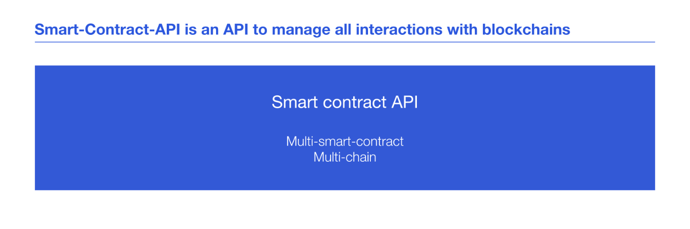
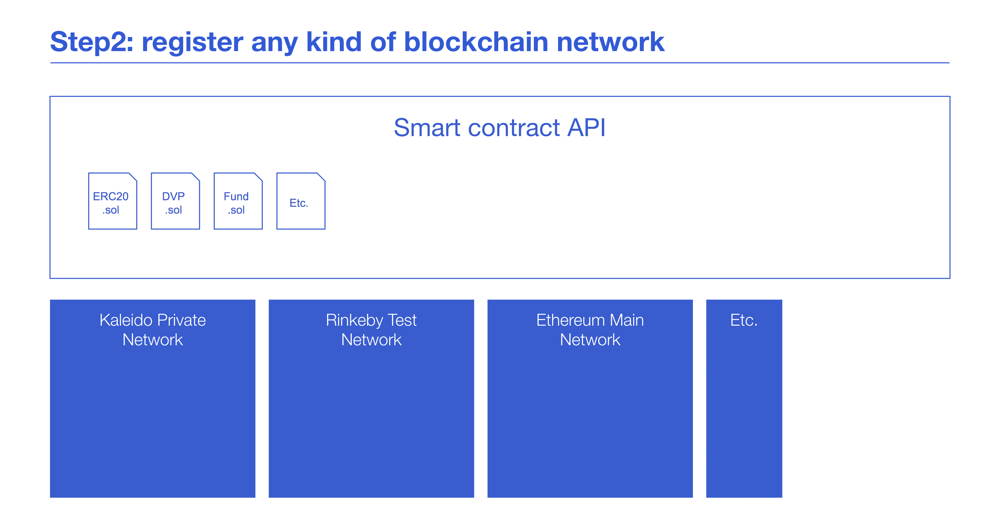
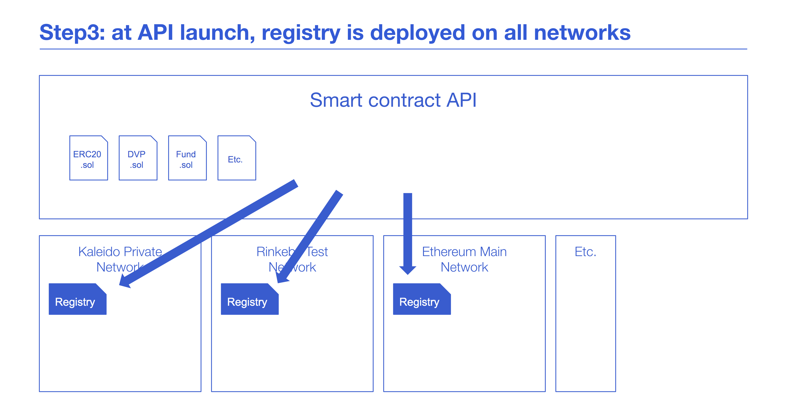
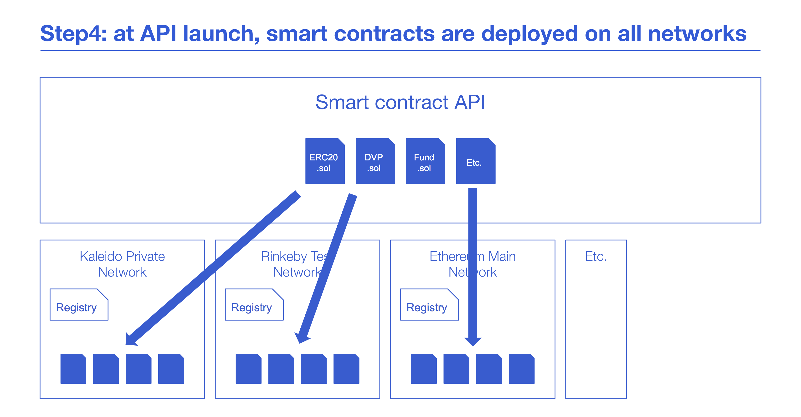
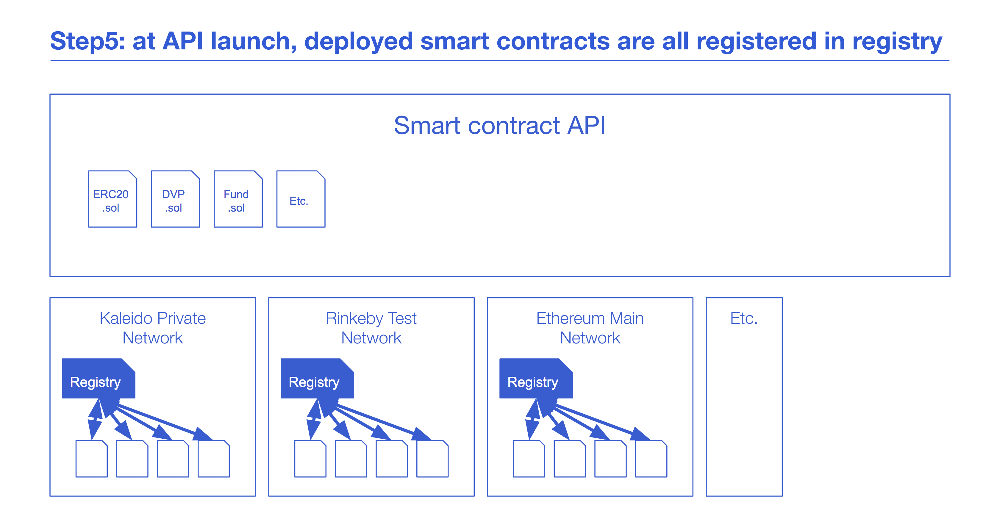

# Smart-Contract-API
## Table of Contents
- [Overview](#overview)
- [Getting Started](#getting-started)
  - [Prerequisites](#prerequisites)
  - [Run Locally](#run-locally)
  - [Environment Variables](#environment-variables)
- [Tests](#tests)
  - [Unit Tests](#unit-tests)
  - [Functional Tests](#functional-tests)
- [Functioning](#functioning)
- [API Documentation](#api-documentation)

## Overview

Smart-Contract-API is a micro-service, part of the global Codefi Assets architecture, a technology stack for tokenization of financial assets

Smart-Contract-API exposes an API to deploy and use smart contracts.
Basically, the module parses the solitidity/json files stored in the folder [./contract](./contract) and generates:

- One enpoint to deploy the smart contract
- One POST endpoint for every non-view function, to send a transaction [WRITE smart contract]
- One GET endpoint for every view function, to a make a contract call [READ smart contract]

## Functioning

## Getting Started

### Prerequisites

#### Orchestrate
Smart-contract-API "write to" and "read from" a blockchain through the service: Orchestrate. So make sure Orchestrate service (found under platform/tools/local-dev-env ) is running before starting Smart-contract-API.


#### Faucet and ERC1820 balances
Ensure for every network listed in [networks](./src/config/networks.js) file:

- faucet address associated to faucet mnemonic ("faucetMnemonic" parameter) is fueled with a sufficient amount of ETH (min: 0.25 ETH).
- ERC1820 registry address (0xa990077c3205cbDf861e17Fa532eeB069cE9fF96) is fueled with a sufficient amount of ETH (min: 0.1 ETH).

### Run Locally

 1. Copy `.env.sample` to `.env` and update the values as needed
 2. Start the service: `docker-compose up --build`

### Environment Variables

#### Initial Configuration

| Name | Optional | Description |
| ---  | --- | --- |

| ASSETS_API_URL | No | Assets-API address |
| ASSETS_API_SECRET | No | Assets-API secret |
| FAUCET_MNEMONIC | No | Faucet blockchain account Used to deploy contracts |
| ORCHESTRATE_NEW_CONTRACT_TX | No | Needed for Orchestrate versions 21.12.1 and above |
| ORCHESTRATE_BROKER_HOST | No | Orchestrate Kafka broker address |
| ORCHESTRATE_BROKER_PORT | No | Orchestrate Kafka broker port |
| ORCHESTRATE_URL | No | Orchestrate API address |
| ORCHESTRATE_TOPIC_RECOVER | No | Orchestrate topic recover |
| ORCHESTRATE_TOPIC_DECODED | No | Orchestrate topic decoded |
| ORCHESTRATE_REGISTRY_TAG | No | Orchestrate registry tag |
| CONTRACTS_DIRECTORY | No | Contracts directory |
| CONTRACTS_CUSTOM_BUILD_DIRECTORY | No | Contracts truffle custom build directory |
| CONTRACTS_TRUFFLE_BUILD_DIRECTORY | No | Contracts truffle build directory |
| DEFAULT_NETWORK_KEY | Yes | Default blockchain network to use when none is specified in the request |
| AUTH0_URL | No | Entity-API address |
| AUTH_BYPASS_AUTHENTICATION_CHECK | Yes | Bypass Auth0 authentication check if configured |
| AUTH_BYPASS_PERMISSION_CHECK | Yes | Bypass Auth0 permission check if configured |
| AUTH_ACCEPTED_AUDIENCE | No | Accepted Auth0 Audience for access tokens |
| AUTH_CUSTOM_NAMESPACE | No | Auth0 custom namespace |
| AUTH_CUSTOM_ORCHESTRATE_NAMESPACE | No | Auth0 custom orchestrate namespace |
| AUTH_HMAC_SECRET | Yes | Hmac secret |
| M2M_TOKEN_REDIS_ENABLE | Yes | Enable M2M tokens caching (default to true) |
| M2M_TOKEN_REDIS_HOST | Yes | Redis Host used to cache M2M tokens |
| M2M_TOKEN_REDIS_PASS | Yes | Redis Pass used to cache M2M tokens |
| M2M_TOKEN_CLIENT_ID | No | Codefi M2M Client ID used to connect to other Codefi apps |
| M2M_TOKEN_CLIENT_SECRET | No | Codefi M2M Client Secret |
| M2M_TOKEN_AUDIENCE | No | Codefi M2M Client Audience |

## Tests
### Functional Tests

#### Run all functional tests:

``` bash
yarn test:functional
```

### How to add a new network in Smart-Contract-API?

The network registry feature is still a manual process (not dynamic).
To register a new network, you need to make a MR on the repo, to add your network to this static file:
src/config/networks.js
 - If you set "tenantId": "codefi" , it will be visible by everyone
 - If you set "tenantId": "id_of_your_tenant" , it will be visible only on you tenant

NB: since the rpcEndpoint are called directly, the rpcEndpoint you'll provide needs to be already authenticated.

The env variable "INFURA_KEY" is used to set the Infura service key to use Ethereum and Polygon mainnets and testnets

Finally, please send ETH to the deployer address corresponding to the mnemonic phrase in the Env variable "FAUCET_MNEMONIC". This is required, since
the deployer will deploy a few generic smart contracts required by Codefi Assets stack at API launch (Ex: Registry, DVP, BatchReader).

ETH is required even for networks with gasprice=0 because of ERC1820 deployment transaction (gas can not be set to 0 for this transaction).

### Configuration without contracts changes

In order to run the project with your own setting, configuration can be change in [./src/config/config.js](./src/config/config.js) and [.env](.env)

_OPTIONAL_
You can also update the contracts you want to deployed when the service launch in [./src/config/config.js](./src/config/config.js):

- ethereum.contracts._ContractName_.deploy: set to `false` if you don't want to deploy this contract by default

### Configuration with contracts changes

To add a new contract to the webservice:

1. Add the contract Solidity file in the folder [./contract](./contract) (only if solidity version matches with solc version in [./package.json](./package.json)) OR add the truffle export in [./buildCustom](./buildCustom) (useful if solidity version matches with solc version in [./package.json](./package.json))
2. Add a section in [./src/config/contractsConfig.js](./src/config/contractsConfig.js) for this contract:
   1. specify if you want it to be deployed by default at service launch
   2. filed 'contract' should be the same than the Solidity file you have added in the folder contracts
   3. address is '0x0'
   4. args are the default parameters that you want to give to the smart contract constructor on service's launch

### Automated smart contract deployment feature

Everytime Smart-Contract-API is launched, it automates deployment of all [smart contracts](./src/config/contractsConfig.ts) (with flag `deploy: true`) on all the [registered networks](./src/config/networks.js).

More specifically, the deployer:

- checks contract registry is deployed on all the networks (registry is always deployed at address 0x1820a4B7618BdE71Dce8cdc73aAB6C95905faD24)
- checks other contracts are deployed on all the networks (by asking to the registry)
- deploys contracts if they are not deployed
- once deployed, registers addresses of deployed contracts in the registry








## API Documentation

API documentation can be found in [./api/swagger.yml](./api/swagger.yml).<br/>
You may use [https://editor.swagger.io](https://editor.swagger.io) to read it
